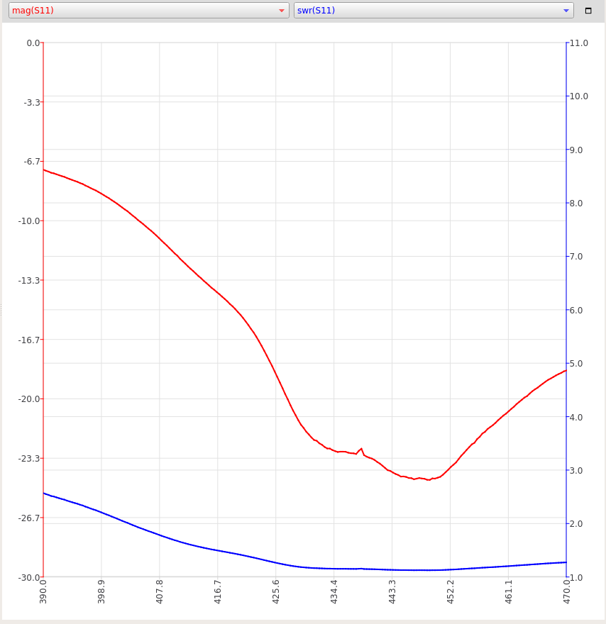

# Ebyte TX433-XPL-100 

Ebyte TX433-XPL-100 Antenna 433MHz High Gain SMA jack Magnetic Base Omnidirectional 1m feeder 

Purchase link (to 2m feeder version) https://a.aliexpress.com/_AdqBiV

Inexpencive lambda/4 whip antenna.

Test setup: NanoVNA V2 china clone, NanoVNA_QT_GUI profram, canned peaches can. Sweep from 390 to 470 MHz, 200 poins.

[Impedances](TX433-XPL-100.csv)

