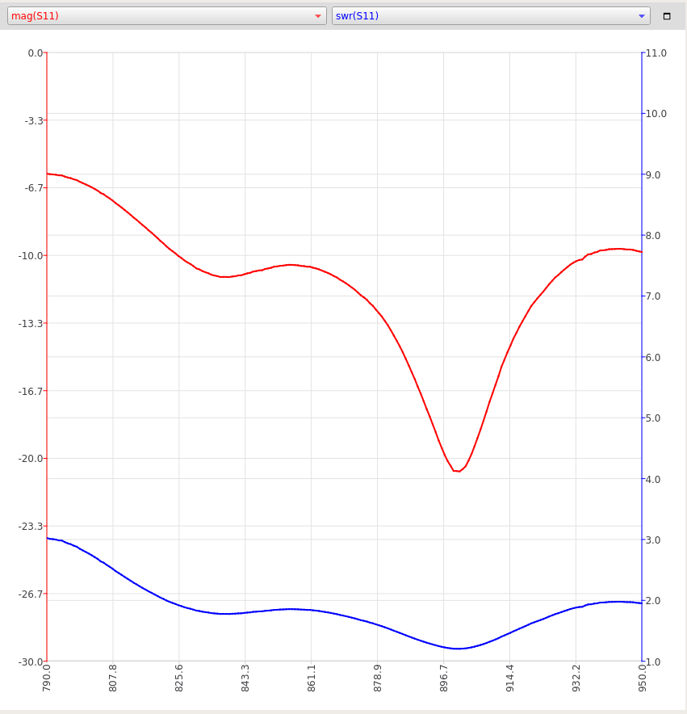

# Ebyte TX868-XPL-100 

Ebyte TX868-XPL-100 Antenna 868MHz 3.5dBi High Gain Omnidirectional SMA Interface Magnetic Base 1m Feeder 

Purchase link: https://a.aliexpress.com/_987405

Inexpencive collinear antenna.

Test setup: NanoVNA V2 china clone, NanoVNA_QT_GUI profram, canned peaches can. Sweep from 790 to 950 MHz, 200 poins.

[S11 parameters](TX868-XPL-100.s1p), [impedances](TX868-XPL-100.csv)

