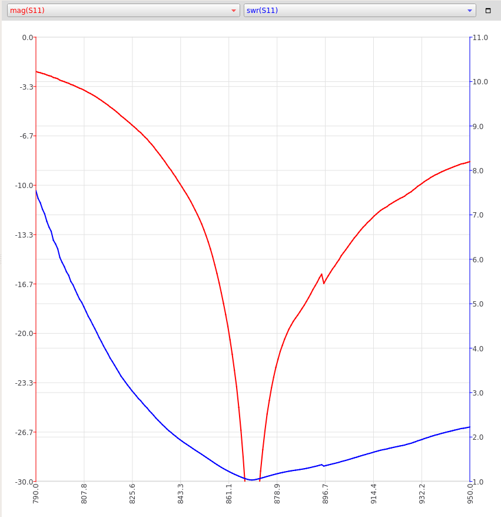

# INNO-868-19WM

White 868MHz LORA Antenna SMA Male Connector 868 MHz 21cm RP-SMA/u.FL Pigtail Cable

Purchase link: https://a.aliexpress.com/_AY2JaH

Test setup: NanoVNA V2 china clone, NanoVNA_QT_GUI profram, canned peaches can. Sweep from 790 to 950 MHz, 200 poins.

[S11 parameters 1](INNO-868-19WM.s1p), [2](INNO-868-19WM-2.s1p), [mpedance](INNO-868-19WM.csv)

