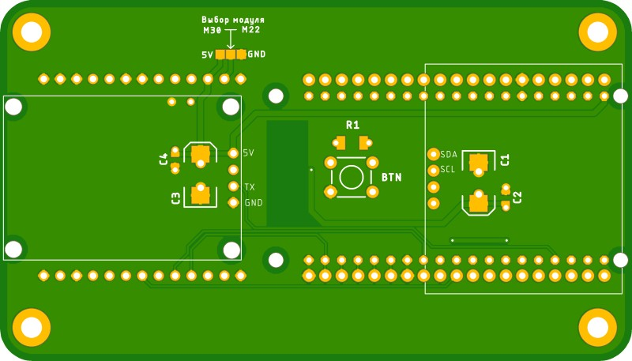

# PCB

Based on [DIY v.1 shematics](https://github.com/NanoVHF/Meshtastic-DIY/tree/main/Schematics/E-Byte_E22) for using with `ESP-WROOM-32 DevKit 38 pins` and `EBYTE E22-XXXM30S/E22-XXXM22S` modules.

Design by Denis Gorbunov (https://t.me/deaxx)

## Mesh-v1.01-2LCD-FreePins

## Mesh-v1.02-2LCD

## Mesh-v1.02-2LCD-FreePins

## Mesh-v1.03-2LCD-FreePins

## Mesh-v1.04-TTGO-T8

## Meshtastic-DIY_v2.2

