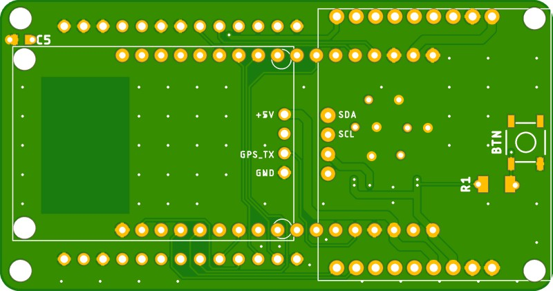
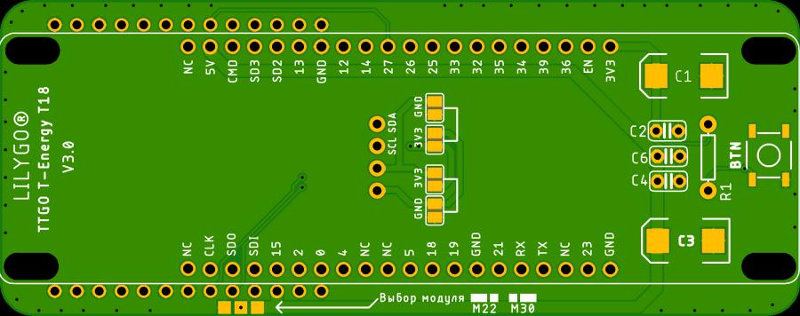
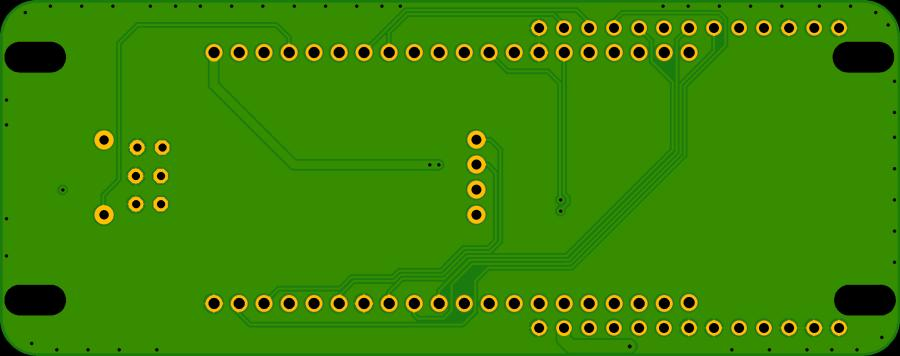
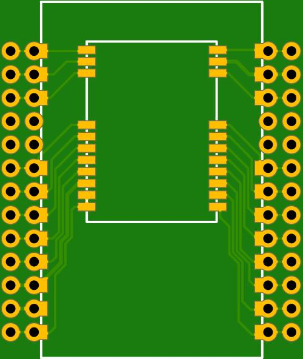
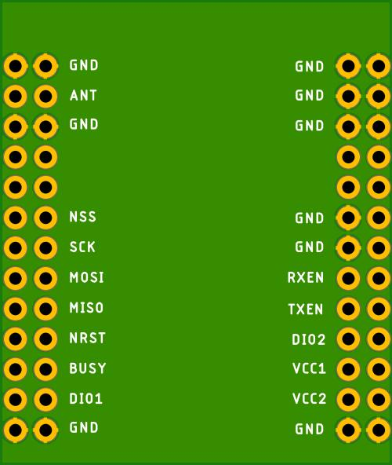

# PCB

Based on [DIY v.1 shematics](https://github.com/NanoVHF/Meshtastic-DIY/tree/main/Schematics/E-Byte_E22) for using with `ESP32 WROOM-32 DevKit 38 pins` and `EBYTE E22-XXXM30S/E22-XXXM22S` modules.

Design by Denis Gorbunov (https://t.me/deaxx)

## Mesh-v1.01-2LCD-FreePins - Basic
- ESP32 WROOM-32 DevKit 38 pins,
- LORA: EBYTE E22-XXXM30S/E22-XXXM22S (selectable module). LoRa is connected via [an additional adapter board](#ebyte-e22-xxxmxxs-adapter-board),
- GPS,
- LCD (select different screens via jumpers: Vcc/GND or GND/Vcc),
- FR (free pins) - free ESP32 pins are placed along the edges of the board.

## Mesh-v1.02-2LCD - Narrow for placing inside a pipe
- ESP32 WROOM-32 DevKit 38 pins,
- LORA: EBYTE E22-XXXM30S/E22-XXXM22S (selectable module. LoRa module soldered directly to the board,
- GPS,
- LCD (select different screens via jumpers: Vcc/GND or GND/Vcc).

## Mesh-v1.02-2LCD-FreePins - Narrow for placing inside a pipe
- ESP32 WROOM-32 DevKit 38 pins,
- LORA: EBYTE E22-XXXM30S/E22-XXXM22S (selectable module. LoRa module soldered directly to the board,
- GPS,
- LCD (select different screens via jumpers: Vcc/GND or GND/Vcc),
- FR (free pins) - free ESP32 pins are placed along the edges of the board.

## Mesh-v1.03-2LCD-FreePins - Compact wearable
- ESP32 WROOM-32 DevKit 38 pins,
- LORA: EBYTE E22-XXXM30S/E22-XXXM22S (selectable module). LoRa is connected via [an additional adapter board](#ebyte-e22-xxxmxxs-adapter-board),
- GPS,
- LCD (select different screens via jumpers: Vcc/GND or GND/Vcc),
- FR (free pins) - free ESP32 pins are placed along the edges of the board.

## Mesh-v1.04-TTGO-T8 - Compact wearable @ WROOWER T8 Lilygo
- ESP32 *WROOWER T8 Lilygo* 38 pins,
- LORA: EBYTE E22-XXXM30S/E22-XXXM22S (selectable module). LoRa is connected via [an additional adapter board](#ebyte-e22-xxxmxxs-adapter-board),
- GPS,
- LCD (select different screens via jumpers: Vcc/GND or GND/Vcc),
- FR (free pins) - free ESP32 pins are placed along the edges of the board.

## Meshtastic-DIY_v1.05 - Square one
- ESP32 WROOM-32 DevKit 38 pins,
- LORA: EBYTE E22-XXXM30S/E22-XXXM22S (selectable module),
- GPS,
- LCD (select different screens via jumpers: Vcc/GND or GND/Vcc),
- Optional active buzzer.

## Meshtastic-DIY_v1.06 - TTGO T-Energy T18 V3.0 HAT
- *Lilygo TTGO T-Energy T18 V3.0*,
- LORA: EBYTE E22-XXXM30S/E22-XXXM22S (selectable module),
- LCD (select different screens via jumpers: Vcc/GND or GND/Vcc).

## EBYTE E22-xxxMxxS adapter board

